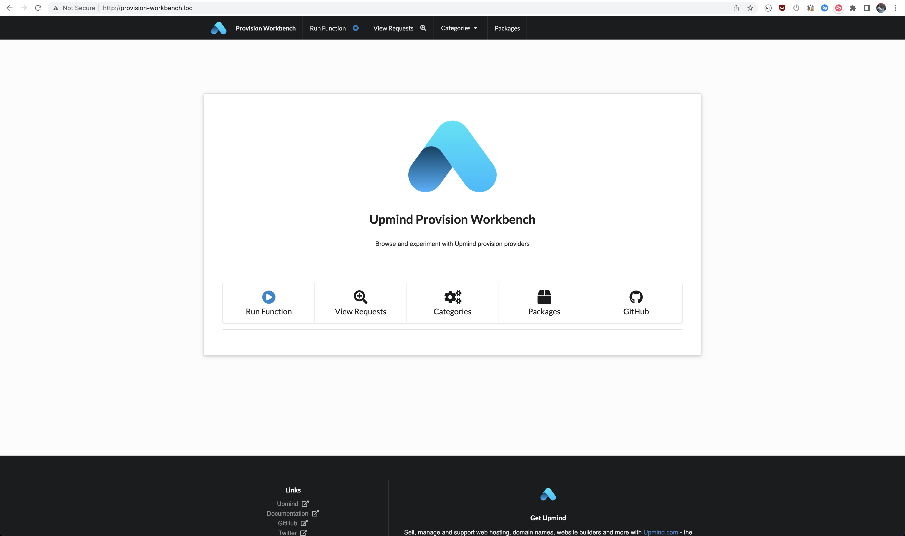
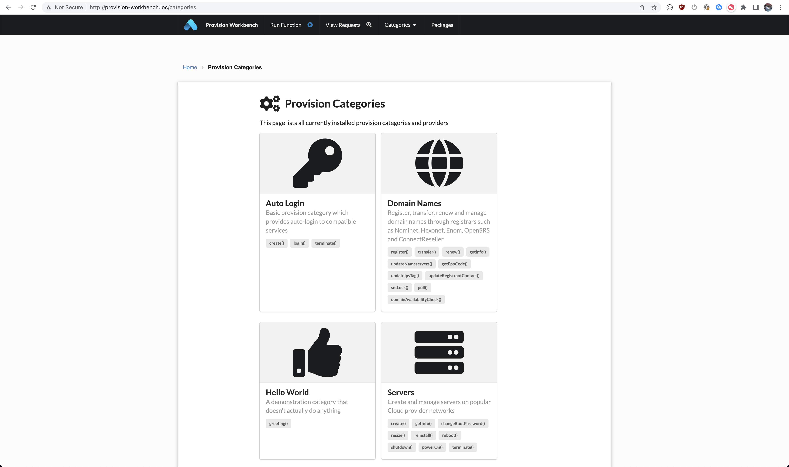
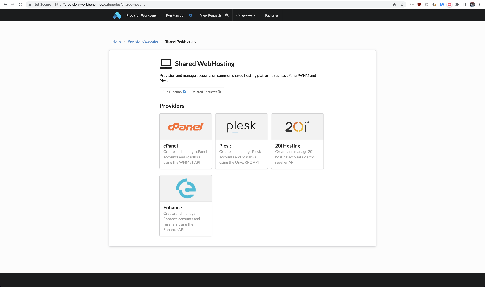
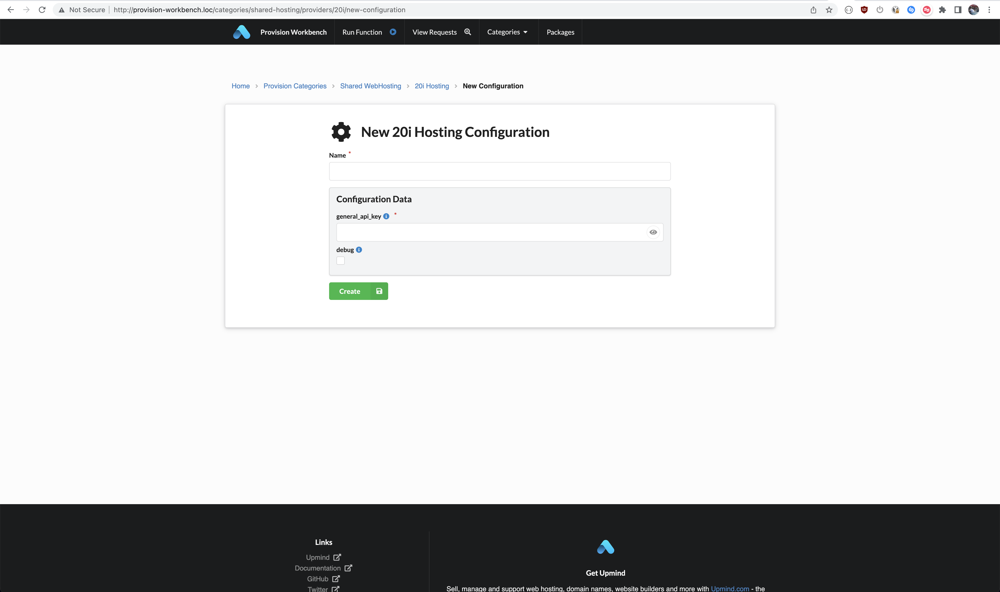
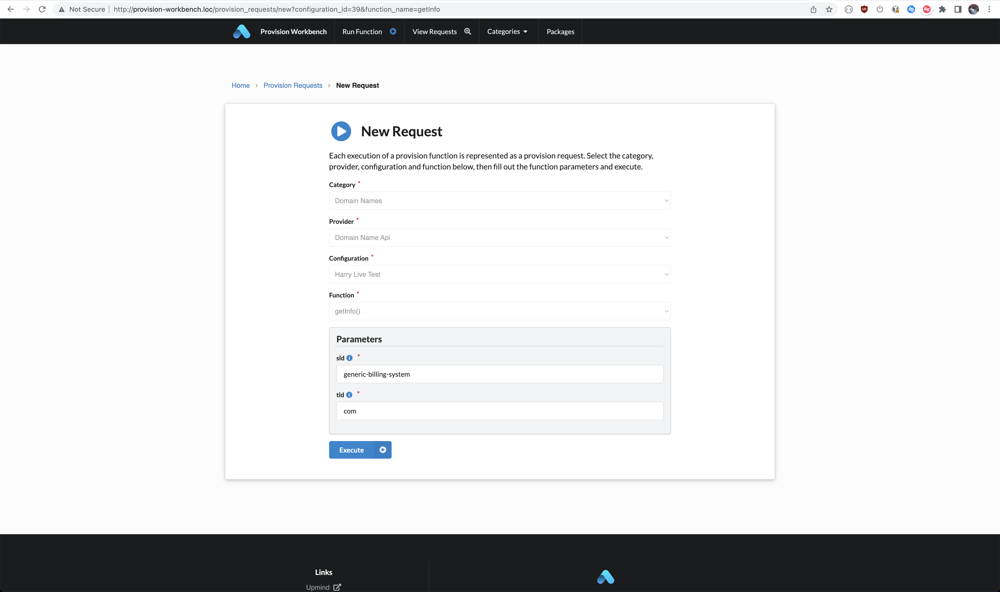
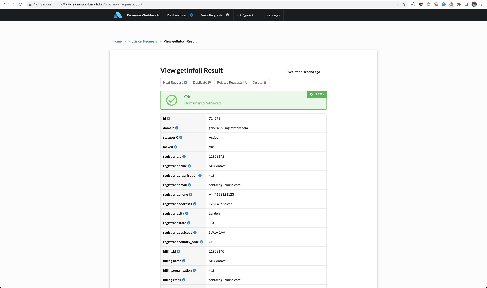
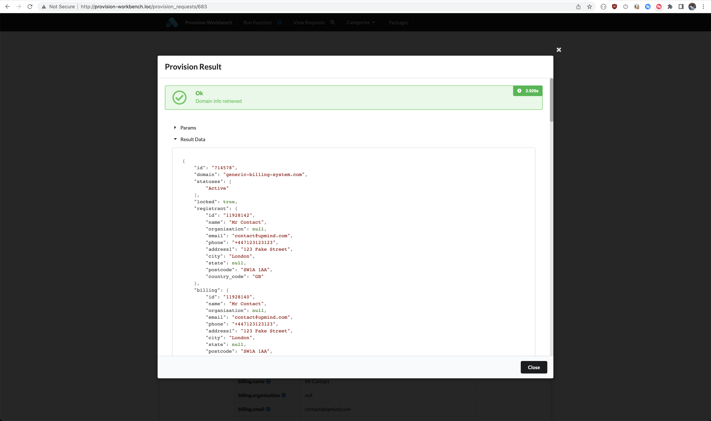
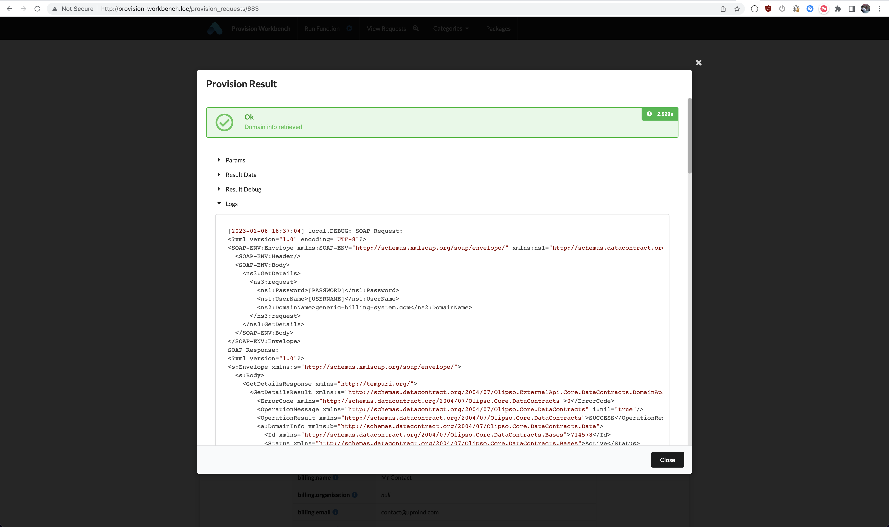
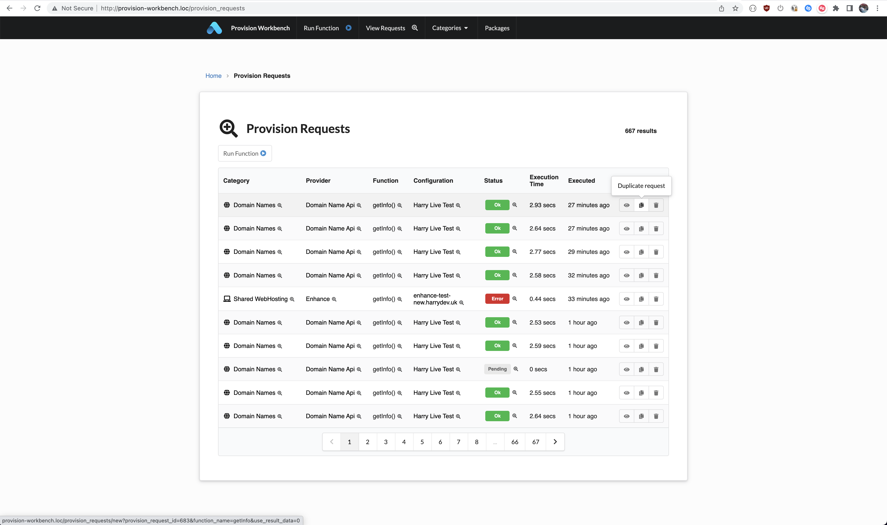

# Upmind Provision Workbench

[](https://packagist.org/packages/upmind/provision-workbench)

A simple web application which provides a UI for quick and easy testing of Upmind provision providers.

- [Requirements](#requirements)
- [Installation](#installation)
  - [Locally](#install-locally)
  - [Using Docker](#using-docker)
- [Quick-start](#quick-start)
- [Usage](#usage)
  - [Screenshots](#screenshots)
- [Changelog](#changelog)
- [Contributing](#contributing)
- [Credits](#credits)
- [License](#license)
- [Upmind](#upmind)

## Requirements

- PHP ^7.4
- Composer

## Installation

**This project is intended to be used as a local development tool only and should NOT be hosted on the internet**

### Install Locally

- Requires PHP 7.4 and composer

Create project:

```bash
composer create-project upmind/provision-workbench --keep-vcs
```

Run application:

```bash
php artisan serve
```

### Using Docker

- Requires git and docker

Clone git repository:

```bash
git clone https://github.com/upmind-automation/provision-workbench.git && cd provision-workbench

```

Build image (may take a few minutes):

```bash
docker build -t provision-workbench .
```

Run container:

```bash
docker run --rm -it -v $(pwd):/provision-workbench -p 8000:80 provision-workbench
```

You'll then be able to access the workbench in a web browser at http://127.0.0.1:8000.

Connect to container (for artisan, composer etc):
```bash
docker exec -it $(docker container ls  | grep 'provision-workbench' | awk '{print $1}') /bin/bash
```

## Quick-start

Install a provision category + providers e.g., shared-hosting:

```bash
composer require upmind/provision-provider-shared-hosting
```

Refresh provision registry (e.g., after adding a new provider or updating data set rules):

```bash
php artisan upmind:provision:cache
```

Install a package locally:

```bash
git clone https://github.com/upmind-automation/provision-provider-domain-names.git local/domain-names \
  && composer require upmind/provision-provider-domain-names:@dev

```

## Usage

This library makes use of [upmind/provision-provider-base](https://packagist.org/packages/upmind/provision-provider-base) primitives which we suggest you familiarize yourself with by reading the usage section in the README.

<details><summary><h3>Screenshots</h3></summary>

#### Homepage




#### Provision Categories



#### Shared Hosting Providers



#### New 20i Configuration



#### New Provision Request



#### Provision Result



#### Provision Result Data



#### Provision Result Logs



#### List Provision Requests


</details>

## Changelog

Please see [CHANGELOG](CHANGELOG.md) for more information on what has changed recently.

## Contributing

Please see [CONTRIBUTING](CONTRIBUTING.md) for details.

## Credits

 - [Harry Lewis](https://github.com/uphlewis)
 - [All Contributors](../../contributors)

## License

GNU General Public License version 3 (GPLv3). Please see [License File](LICENSE.md) for more information.

## Upmind

Sell, manage and support web hosting, domain names, ssl certificates, website builders and more with [Upmind.com](https://upmind.com/start) - the ultimate web hosting billing and management solution.
